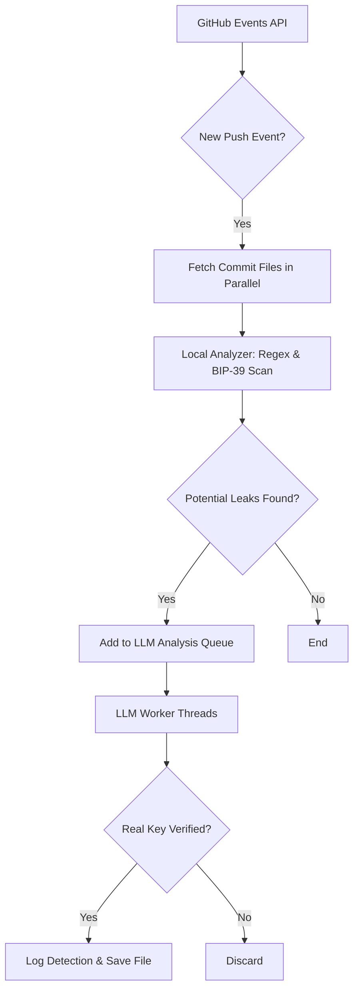

# github-stream


This project is an automated detection system designed to find exposed cryptocurrency private keys and seed phrases in public GitHub repositories in real-time. It uses a highly efficient, multi-stage pipeline that combines fast local analysis with powerful Large Language Model (LLM) verification to ensure both high speed and high accuracy.

## Architecture

The scanner operates on a fully parallel, multi-stage pipeline designed for maximum efficiency and responsiveness:



## Features

- **Real-Time Monitoring:** Scans new commits from the public GitHub Events API as they happen.
- **Intelligent Multi-Stage Analysis:**
    1.  A fast, parallelized download of all relevant files in a commit.
    2.  A highly efficient local analysis using a library of specific regex patterns and an intelligent, multi-line BIP-39 seed phrase detector.
    3.  A parallelized batch analysis of all potential leaks by a powerful LLM for final verification.
- **Flexible LLM Backend:** Supports both local LLMs via Ollama (recommended) and direct model loading via the Hugging Face `transformers` library.
- **Configurable:** Easily switch between different LLMs, scanning modes, and providers through a simple and well-documented configuration file.
- **Interactive:** Allows you to skip repositories on the fly with a simple command (`s` + Enter) and limits the number of files scanned per repository to avoid getting bogged down.
- **Actionable Output:** Provides clear, color-coded logs and saves the full content of any detected leak to a local directory with a detailed metadata header for easy review.
- **Comprehensive Test Suite:** Includes an accuracy test suite to verify and benchmark the performance of the LLM and the detection logic.

## Project Structure

```
.
├── detected_leaks/      # Saved files with detected secrets
├── scanner/
│   ├── logs/
│   │   └── detections.log # Log file for all verified leaks
│   ├── __init__.py
│   ├── analyzer.py      # Local analysis (regex & BIP-39)
│   ├── config.py        # Your local (ignored) configuration
│   ├── llm_analyzer.py  # LLM-based verification
│   └── main.py          # Main script to monitor GitHub
├── scripts/
│   ├── clear_logs.sh    # Utility to clear logs and leaks
│   └── proxy_tester/    # Advanced proxy testing utility
├── tests/
│   ├── samples/         # Sample files for accuracy testing
│   └── test_accuracy.py # Script to test LLM accuracy
├── .gitignore
├── README.md
├── requirements.txt
└── scanner/config.example.py # Template for configuration
```

## Getting Started

1.  **Clone the repository.**

2.  **Install dependencies:**
    ```bash
    pip install -r requirements.txt
    ```

3.  **Configure the scanner:**
    -   Create your local configuration file: `cp scanner/config.example.py scanner/config.py`
    -   Edit `scanner/config.py` and add your **GitHub Personal Access Token**.

4.  **Set up your LLM Provider (Ollama Recommended):**
    -   Install Ollama from [ollama.com](https://ollama.com).
    -   Download your chosen model (e.g., `mistral:7b-instruct-v0.2-q4_1`):
        ```bash
        ollama run mistral:7b-instruct-v0.2-q4_1
        ```
    -   Ensure the `LLM_PROVIDER` in your `config.py` is set to `"ollama"` and the `model` is correct.

## Usage

-   **Run the scanner** (use `--verbose` for detailed logging):
    ```bash
    python3.9 -m scanner.main --verbose
    ```

-   **Run the accuracy test** to verify your setup:
    ```bash
    python3.9 tests/test_accuracy.py
    ```

