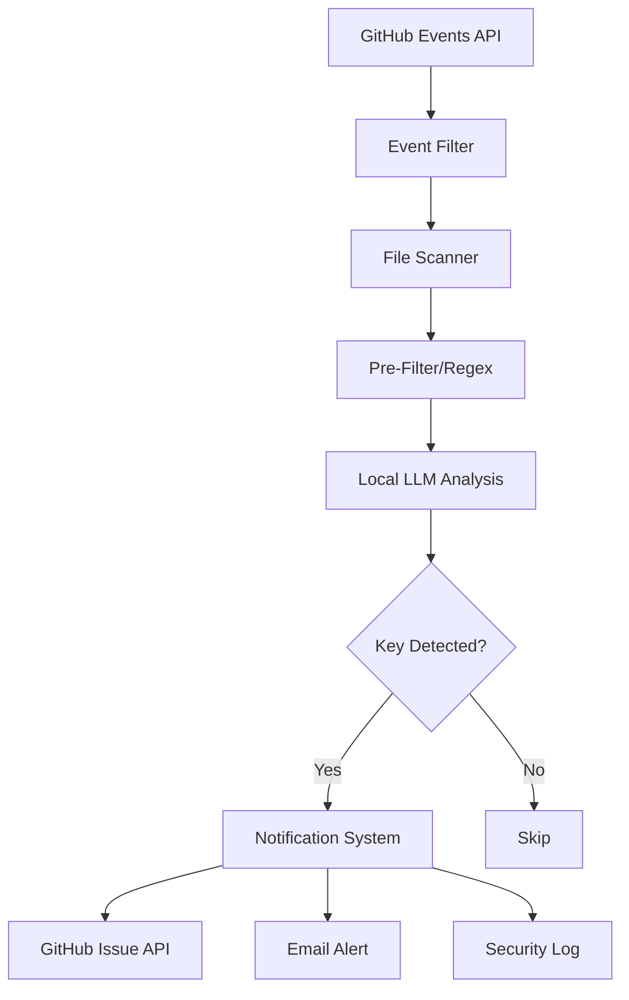

## Cryptocurrency Private Key Detection Agent - Technical Specification

### 1. Project Overview
**Purpose**: Automated detection and notification system for exposed cryptocurrency private keys in public GitHub repositories
**Goal**: Protect users by alerting them to accidentally exposed private keys

Keys will be stored in a log file so the user can be alerted.

### 2. System Architecture



### 3. Technical Components

#### 3.1 Data Collection Module
```yaml
Component: GitHub Event Stream Monitor
Responsibilities:
  - Monitor GitHub Events API
  - Filter for PushEvents
  - Queue repositories for scanning

Technical Details:
  - Poll interval: 30 seconds
  - Event buffer: 1000 events
  - Focus on: .env, config, wallet files

Rate Limits:
  - Authenticated: 5000 req/hour
  - Implement exponential backoff
```

#### 3.2 Detection Pipeline
```yaml
Component: Multi-Stage Key Detector
Stages:
  1. File Filter:
     - Target files: *.env, *.json, *.yaml, *.md
     - Skip: images, binaries, large files (>1MB)

  2. Regex Pre-Filter:
     - Bitcoin: ^[5KL][1-9A-HJ-NP-Za-km-z]{50,51}$
     - Ethereum: ^0x[a-fA-F0-9]{64}$
     - Seed phrases: 12-24 word patterns

  3. LLM Analysis:
     - Model: Phi-3-mini or Llama3.2-1B
     - Context window: 512 tokens
     - Classification: REAL_KEY, TEST_KEY, NOT_KEY
```

#### 3.3 LLM Configuration
```yaml
Component: Local LLM Analyzer
Model Requirements:
  - Size: <4GB RAM
  - Inference: <100ms per request
  - Quantization: INT8 or INT4

Prompt Template: |
  Analyze if this code contains a REAL cryptocurrency private key or seed phrase.
  Consider:
  - Is it in a test file?
  - Are there obvious test/example markers?
  - Is the format valid?

  Content: {code_snippet}

  Respond only: REAL_KEY, TEST_KEY, or NOT_KEY
```

### 4. Implementation Phases

#### Phase 1: Core Detection (Week 1-2)
- [ ] Set up GitHub API integration
- [ ] Implement regex pre-filters
- [ ] Create file scanning pipeline
- [ ] Build basic notification system

#### Phase 2: LLM Integration (Week 3-4)
- [ ] Set up local LLM (Ollama/llama.cpp)
- [ ] Create classification prompts
- [ ] Implement batching for efficiency
- [ ] Test accuracy on known datasets

#### Phase 3: Notification System (Week 5-6)
- [ ] GitHub issue creation API
- [ ] Email notification system
- [ ] Rate limiting and queuing
- [ ] Security audit logging

#### Phase 4: Optimization (Week 7-8)
- [ ] Performance tuning
- [ ] False positive reduction
- [ ] Monitoring dashboard
- [ ] Documentation

### 5. Security & Privacy Requirements

```yaml
Critical Security Rules:
  - NEVER store or log private keys
  - Memory scrubbing after detection
  - No network requests with key data
  - Encrypted local storage for configs

Privacy Measures:
  - Hash detected patterns immediately
  - No user tracking
  - Minimal data retention (24 hours max)
  - GDPR compliant notifications
```

### 6. Performance Targets

```yaml
Metrics:
  - Repositories scanned/hour: 1000+
  - Detection latency: <5 seconds
  - False positive rate: <5%
  - Memory usage: <2GB
  - CPU usage: <25% (4 cores)
```

### 7. Notification Templates

Simply create a text file with the following structure:

```yaml
GitHub Issue:
  title: "🔒 Security Alert: Potential Private Key Exposure"
  body: |
    Our automated security scan detected a potential cryptocurrency
    private key in your repository.

    **File**: {filepath}
    **Commit**: {commit_sha}

    **Recommended Actions**:
    1. Remove the file/commit immediately
    2. If this was a real key, transfer funds to a new wallet
    3. Use environment variables for sensitive data
```

### 8. Development Environment

```bash
# Required packages
python>=3.9
transformers>=4.30.0
ollama>=0.1.0
github3.py>=3.2.0
redis>=4.5.0  # For queuing
fastapi>=0.100.0  # For API
```

### 9. Testing Strategy

```yaml
Unit Tests:
  - Regex pattern matching
  - LLM prompt formatting
  - API interactions

Integration Tests:
  - Full pipeline execution
  - Notification delivery
  - Rate limit handling

Test Dataset:
  - 100 real keys (in secure environment)
  - 1000 fake/test keys
  - 10000 non-key code samples
```

### 10. Monitoring & Metrics

```yaml
Dashboard Metrics:
  - Scan rate (repos/hour)
  - Detection rate
  - False positive rate
  - API rate limit status
  - LLM inference time
  - Notification delivery rate

Alerts:
  - API rate limit approaching
  - High false positive rate
  - System resource warnings
  - Notification failures
```

### 11. Future Enhancements

- Support for more cryptocurrencies
- Integration with bug bounty platforms
- Pre-commit hook distribution
- Browser extension for developers
- ML model fine-tuning on feedback

Would you like me to elaborate on any specific section or create implementation code for particular components?
